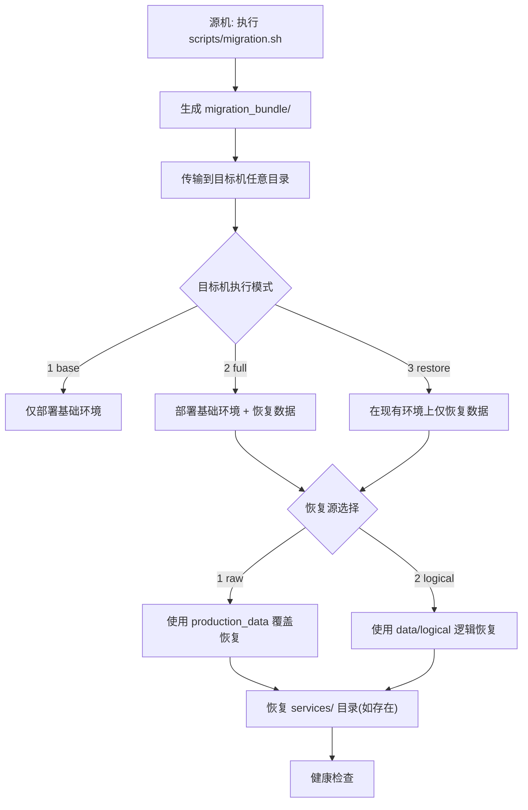

# infra-base 迁移操作手册

本文档按“实际执行顺序”说明如何打包、传输、恢复。按步骤执行即可。

## 1. 总流程图



## 2. 打包步骤（源机）

执行命令：

```bash
sh scripts/migration.sh
```

交互项说明（按出现顺序）：

1. `项目名称`
- 含义：用于定位运行中的 compose 容器。
- 规则：必填；不存在会要求重新输入。

2. `统一密码`
- 含义：pg/mongodb/minio 的访问密码。
- 规则：必填。

3. `迁移包版本`
- 含义：目录名 `migration_bundle/<version>`。
- 规则：`x.y.z` 格式；错误会循环重输。

4. `迁移描述`
- 含义：写入 `manifest.json`。
- 规则：必填；为空会循环重输。

5. `数据备份模式`
- `1) raw`：携带 `production_data/`（快，强依赖环境一致）
- `2) logical`：导出 `data/logical/`（兼容更好）
- `3) both`：两者都做（推荐，最稳）

6. `是否导出离线镜像`
- `y`：生成 `images/all-images.tar`
- `n`：不导出镜像（目标机需能拉镜像）

7. `数据项勾选`
- 目前支持：`PostgreSQL(tsdb)`、`MongoDB(mongo)`、`MinIO(minio)`。
- 默认全选；按业务需要取消。

## 3. 传输步骤

将 `migration_bundle/<version>` 整个目录上传到目标机任意位置，例如：

```bash
/usr/local/infra-base/migration_bundle/1.0.1
```

## 4. 部署/恢复步骤（目标机）

执行命令：

```bash
sh infractl.sh
```

### 4.1 模式选择（数字输入）
- `1) base`：仅基础环境，不恢复数据
- `2) full`：部署 + 恢复（新机器迁移常用）
- `3) restore`：已有环境仅恢复数据

### 4.2 full/restore 的恢复源选择规则
- 仅有 `raw`：只能选 `1`（回车默认 `1`）
- 仅有 `logical`：只能选 `2`（回车默认 `2`）
- 两者都有：可选 `1/2`（默认 `2`，推荐）

含义：
- `1 raw`：用 `production_data` 覆盖目标机数据目录
- `2 logical`：用 `data/logical` 恢复（跨环境更稳）

密码规则：
- `raw`：恢复时优先使用迁移包 `.env` 中的 `COMMON_PASSWORD`（建议与源环境保持一致）
- `logical`：按目标环境输入的统一密码恢复

## 5. 目录结构示例

```sh
infra-base
└── migration_bundle
    └── 1.0.1                        # 版本目录（示例）
        ├── apisix/                  # infra-base 基础文件复制
        ├── config/
        ├── dockerx/
        ├── nginx/
        ├── infractl.sh              # 根目录统一入口
        ├── scripts/
        │   ├── install.sh
        │   ├── start.sh
        │   ├── uninstall.sh
        │   ├── deploy_services.sh
        │   ├── migration.sh
        │   ├── restore.sh
        │   ├── init_sample_data.sh
        │   └── generate_services.sh
        ├── docker-compose.yml
        ├── docker_daemon.json
        ├── services/                # 业务服务目录（按源机原样复制）
        │   └── <service>/docker-compose.yml
        ├── production_data/          # 仅当备份模式含 raw 时存在
        │   ├── tsdb/                 # 可按交互勾选
        │   ├── mongo/
        │   └── minio/
        ├── images/
        │   ├── all-images.tar       # 离线镜像包（按交互选择）
        │   ├── images.txt            # 收集到的镜像列表
        │   ├── images.existing.txt   # 本机存在并参与导出的镜像
        │   └── images.missing.txt    # 本机缺失并被跳过的镜像
        ├── data/
        │   └── logical/
        │       ├── pg/
        │       │   ├── globals.sql   # PostgreSQL 全局对象（角色等）
        │       │   ├── db_list.txt   # PostgreSQL 数据库清单
        │       │   ├── db_meta.tsv   # PostgreSQL 数据库特性标记（如 timescaledb）
        │       │   └── *.dump        # PostgreSQL 每库 pg_dump -Fc 备份
        │       ├── mongo.archive.gz  # MongoDB 逻辑备份（可选）
        │       └── minio/            # MinIO 对象逻辑备份（可选）
        ├── manifest.json
        └── checksums.sha256
```

## 6. 恢复后检查（必须做）

1. 容器状态检查：
```bash
docker x ps <project>
```

2. 日志抽查：
```bash
docker x logs <project> tsdb
docker x logs <project> mongo
docker x logs <project> minio
```

3. 业务验证：
- 登录/核心 API/文件上传下载至少各测 1 次。

## 7. 选择建议（快速决策）

1. 同版本同架构、追求速度：`raw`  
2. 跨环境迁移、追求稳定：`logical`  
3. 不确定风险时：打包选 `both`，恢复默认选 `logical`  
